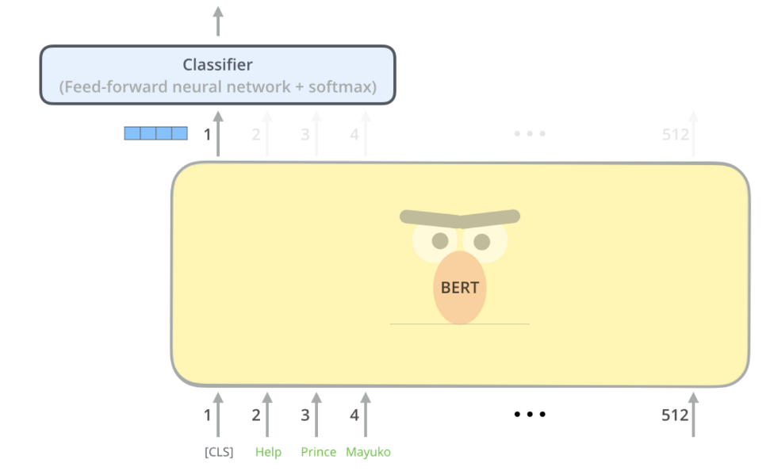

# Portfolio
---
## Natural Language Processing

### Podcast Analyzer

Podcast Analyzer is a tool built with Streamlit, Whisper, LangChain to analyze the content of podcasts. The app transcribes YouTube links using the Whisper ASR API, displays transcriptions, identifies named entities, answers questions about the content, and provides a summary and topic modeling of the podcast content. 

### Kaggle Notebook: Comprehensive Guide to Text Preprocessing with Python

Performing initial data investigation is the first step in every data science project. Examining the data helps us understand its structure, discover patterns, and evaluate data quality.

This is a starter notebook for natural language processing in text processing. It will show you how to summarize and visualize your textual data to gain valuable insights and understanding for your NLP project. It covers text preprocessing and analysis in comprehensive detail.

---
### Kaggle Competetion: Natural Language Processing with Disaster Tweets

I performed a quick exploratory data analysis to understand the dataset, performed text cleaning, and fine-tuned BERT to predict which tweets are about real disasters and which are not. My best model had an F1 score of 0.84523, ranking 24th out of 947, or approximately in the top 2% on the Kaggle leaderboard. This notebook provides a beginner-friendly explanation of concepts such as cross-validation, hyperparameter tuning, and fine-tuning transformer-based models.

---
### Twitter Daily Auto Scraper: House Of the Dragon Analysis

This notebook on Kaggle is a complete guide for extracting and analyzing Twitter data related to a specific topic. It focuses on scraping tweets about HBO's 'House of the Dragon' series using the `Twitter API v2` and updates the dataset daily. The notebook also covers text preprocessing techniques to clean the data and presents various analyses, such as identifying the most mentioned characters and their frequency in the tweets.

 

 

---
---
## Data Science

### Data Science & Machine Learning
My complete implementation of assignments for [***22700/1: Data Science & Machine Learning***](https://www.uni-regensburg.de/wirtschaftswissenschaften/bwl-roesch/lehre/data-science-machine-learning/index.html) at the University of Regensburg (WS 19/20)..

---

© 2023 Ahmad Alismail. Powered by Jekyll and the Minimal Theme.

